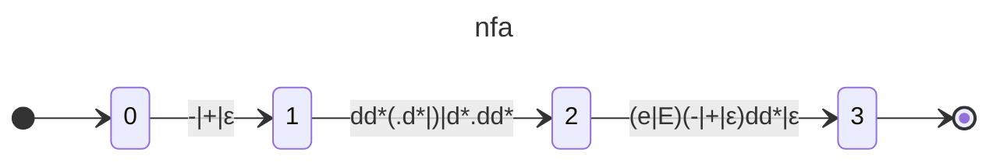
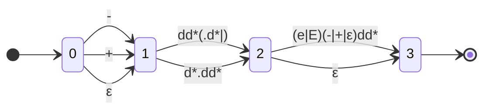
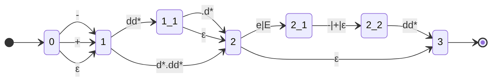
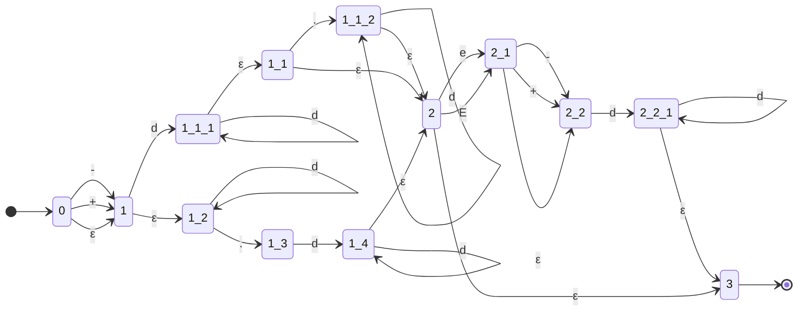
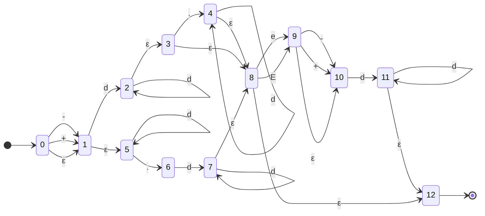

# DFA collection

## [65.有效数字](../src/65.有效数字.java)

正规式
> d = 0|1|2|3|4|5|6|7|8|9
> (-|+|)(dd*(.d*|)|d*.dd*)((e|E)(-|+|)dd*|)

nfa确定化
| | - | + | d | . | e | E |
| - | - | - | - | - | - | - |
| `{0,1,5}`Sº | `{1,5}` | `{1,5}` | `{2,3,5,8,12}` | `{6}` |  |  |
| `{1,5}`A |  |  | `{2,3,5,8,12}` | `{6}` |  |  |
| `{2,3,5,8,12}`B* |  |  | `{2,3,5,8,12}` | `{4,6,8,12}` | `{9,10}` | `{9,10}` |
| `{6}`C |  |  | `{7,8,12}` |   |   |   |
| `{4,6,8,12}`D* |  |  | `{4,7,8,12}` |  | `{9,10}` | `{9,10}` |
| `{9,10}`E | `{10}` | `{10}` | `{11,12}` |  |  |  |
| `{7,8,12}`F* |  |  | `{7,8,12}` |  | `{9,10}` | `{9,10}` |
| `{4,7,8,12}`G* |  |  | `{4,7,8,12}` |  | `{9,10}` | `{9,10}` |
| `{10}`H |  |  | `{11,12}` |  |  |  |
| `{11,12}`I* |  |  | `{11,12}` |  |  |  |

dfa状态转换表（已无法最小化）
| | - | + | d | . | e | E |
| - | - | - | - | - | - | - |
| Sº | A | A | B* | C |  |  |
| A |  |  | B* | C |  |  |
| B* |  |  | B* | D* | E | E |
| C |  |  | F* |   |   |   |
| D* |  |  | G* |  | E | E |
| E | H | H | I* |  |  |  |
| F* |  |  | F* |  | E | E |
| G* |  |  | G* |  | E | E |
| H |  |  | I* |  |  |  |
| I* |  |  | I* |  |  |  |
