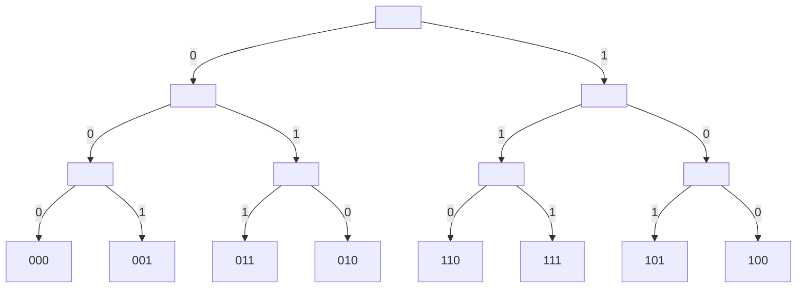

# dfs collection

## [37.解数独（子集树）](../37.解数独.java)

bit manipulation:

1. ^ `0不变，1取反`
    - ^0: 0 -> 0; 1 -> 1;
    - ^1: 0 -> 1; 1 -> 0;
2. b & (−b) `得到b最后一个1的位置代表的数`
    -b = ~b + 1
    ~b最后一个1之后的0都变成1，1变成0
    ~b+1之后，-b在b的最后一个1处变为1，后面的位都为0，故b & (-b)可以得到b最后一个1的位置
3. b & (b - 1) == 0 `为0或只有一个1`

## [39.组合总和（子集树）](../39.组合总和.java)

## [40.组合总和-ii（子集树）](../40.组合总和-ii.java)

## [46.全排列（排列树）](../46.全排列.java)

## [47.全排列-ii（排列树）](../47.全排列-ii.java)

## [51.N皇后（排列树）](../51.n-皇后.java)

## [52.N皇后II（排列树）](../52.n-皇后-ii.java)

## [77.组合（组合树）](../77.组合.java)

## [78.子集（子集树）](../78.子集_1.java)

## [79.单词搜索（子集树）](../79.单词搜索.java)

## [89.格雷编码（子集树）](../89.格雷编码_1.java)

## [90.子集-ii（子集树）](../90.子集-ii.java)

## [93.复原IP地址（子集树）](../93.复原ip地址.java)

## [94.二叉树的中序遍历](../94.二叉树的中序遍历_1.java)

## [95.不同的二叉搜索树-ii](../95.不同的二叉搜索树-ii_1.java)

## [98.验证二叉搜索树](../98.验证二叉搜索树.java)

## [99.恢复二叉搜索树](../99.恢复二叉搜索树_1.java)

## [100.相同的树](../100.相同的树.java)

## [101.对称二叉树](../101.对称二叉树.java)

## [111.二叉树的最小深度](../111.二叉树的最小深度.java)

## [112.路径总和](../112.路径总和.java)

## [113.路径总和-ii](../113.路径总和-ii.java)

## [116.填充每个节点的下一个右侧节点指针](../116.填充每个节点的下一个右侧节点指针_1.java)

## [124.二叉树中的最大路径和](../124.二叉树中的最大路径和.java)

## [126.单词接龙-ii](../126.单词接龙-ii_1.java)

指数级别，超时。

## [129.求根到叶子节点数字之和](../129.求根到叶子节点数字之和.java)

## [130.被围绕的区域](../130.被围绕的区域.java)

## 131.分割回文串

1. [动态规划$\rightarrow$回溯构造解](../131.分割回文串.java)

2. [回溯$+$记忆化搜索](../131.分割回文串_1.java)

## [132.分割回文串-ii](../132.分割回文串-ii_2.java)

动态规划$\rightarrow$回溯构造解 `超时`。

## [133.克隆图](../133.克隆图_1.java)

## [139.单词拆分](../139.单词拆分_1.java)

记忆化搜索。

## [140.单词拆分-ii](../140.单词拆分-ii.java)

记忆化搜索。

## [144.二叉树的前序遍历](../144.二叉树的前序遍历_1.java)

## [145.二叉树的后序遍历](../145.二叉树的后序遍历_1.java)

## [199.二叉树的右视图](../199.二叉树的右视图_1.java)

## [200.岛屿数量](../200.岛屿数量_1.java)

## [207.课程表](../207.课程表_1.java)

转化为图的拓扑排序问题。

## [210.课程表-ii](../210.课程表-ii_1.java)

转化为图的拓扑排序问题。

## [211.添加与搜索单词-数据结构设计](../211.添加与搜索单词-数据结构设计.java)

`字典树` + `深搜`。

## [212.单词搜索-ii](../212.单词搜索-ii.java)

`字典树` + `深搜`。

## 216.组合总和-iii

1. [二进制（子集树）枚举](../216.组合总和-iii_1.java)

    - 时间复杂度：$O(M\times 2^M)$，其中 $M$ 为集合的大小，本题中 $M$ 固定为 $9$。一共有 $2^M$ 个状态，每个状态需要 $O(M+k)=O(M)$ 的判断 （$k\leq M$），故时间复杂度为 $O(M\times 2^M)$。

    - 空间复杂度：$O(M)$。

2. [回溯（组合树）](../216.组合总和-iii.java)

    - 时间复杂度：$O({M\choose k}\times k)$，其中 $M$ 为集合的大小，本题中 $M$ 固定为 $9$。一共有 $M\choose k$ 个组合，每次判断需要的时间代价是 $O(k)$。通过剪枝，实际时间复杂度会远远小于 $O({M\choose k}\times k)$。

    - 空间复杂度：$O(M)$。

## 222.完全二叉树的节点个数

1. [完全遍历](../222.完全二叉树的节点个数_2.java)

    - 时间复杂度：$O(n)$。

    - 空间复杂度：$O(\log n)$，递归栈高度。

2. [二分查找](../222.完全二叉树的节点个数_1.java)

    - 时间复杂度：$O(\log n\times \log n)$。

    - 空间复杂度：$O(\log n)$，递归栈高度。

3. [二分查找+位运算](../222.完全二叉树的节点个数.java)

    - 时间复杂度：$O(\log n\times \log n)$。

    - 空间复杂度：$O(1)$。

## [226.翻转二叉树](../226.翻转二叉树_1.java)

## [230.二叉搜索树中第K小的元素](../230.二叉搜索树中第K小的元素_2.java)

## 236.二叉树的最近公共祖先

1. [哈希表记录父节点+深搜](../236.二叉树的最近公共祖先_2.java)

2. [两次深搜找到节点路径](../236.二叉树的最近公共祖先_1.java)

3. [深搜+剪枝](../236.二叉树的最近公共祖先.java)

## [241.为运算表达式设计优先级](../241.为运算表达式设计优先级_1.java)

`子集树` + `记忆化搜索`。

## [257.二叉树的所有路径](../257.二叉树的所有路径.java)

## [279.完全平方数](../279.完全平方数_2.java)

记忆化搜索。

## [297.二叉树的序列化与反序列化](../297.二叉树的序列化与反序列化_1.java)

## 301.删除无效的括号

1. [集合去重](../301.删除无效的括号_2.java)

2. [预处理+跳过重复元素去重](../301.删除无效的括号_1.java)

## [306.累加数](../306.累加数.java)

## [310.最小高度树](../310.最小高度树_1.java)

设路径距离最长的两点 $x$，$y$ 的距离为 $\max(distance)$。由于树可以翻折，要使得树的高度最小，必须对在路径的中点翻折处翻折，此时树的根即为 $x$，$y$ 路径的中点。由于其它结点间的距离 $distance_{i\rightarrow j}\le\max(distance)$，故经过翻折后的高度不可能超过 $x$，$y$ 翻折后的高度。

要找到图的距离最长的两点（直径），可以随机找一点 $a$，找到其最远的点 $x$，再找到 $x$ 的最远点 $y$，$x$，$y$ 即为图的距离最长的两点。证明：若 $y=a$ 或者 $x=a$，两点最长路径都是对方，说明两点必然位于直径上；若 $y\neq a$ 且 $x\neq a$，由于 $x$ 到 $a$ 最长，$y$ 到 $a$ 最长，故 $x$，$y$ 必然位于直径上。

- 时间复杂度：$O(n)$

- 空间复杂度：$O(n)$

## [312.戳气球](../312.戳气球_1.java)

每次找一个位置进行添加，递归进行剩余位置的添加；利用记忆化搜索进行剪枝。

## [322.零钱兑换](../322.零钱兑换_1.java)

记忆化搜索。

## [399.除法求值](../399.除法求值_3.java)

## [433.最小基因变化](../433.最小基因变化_1.java)

## 437.路径总和 III

1. [自下而上枚举](../437.路径总和-iii_1.java)

    - 时间复杂度 $O(n_2)$。

    - 空间复杂度 $O(n)$。

2. [前缀和优化](../437.路径总和-iii.java)

    - 时间复杂度 $O(n)$。

    - 空间复杂度 $O(n)$。

## [530.二叉搜索树的最小绝对差](../530.二叉搜索树的最小绝对差.java)

## [547.省份数量](../547.省份数量_1.java)

## [637.二叉树的层平均值](../637.二叉树的层平均值.java)

## [841.钥匙和房间](../841.钥匙和房间.java)

## [872.叶子相似的树](../872.叶子相似的树.java)

## [1161.最大层内元素和](../1161.最大层内元素和_1.java)

## [1372.二叉树中的最长交错路径](../1372.二叉树中的最长交错路径.java)

## [1448.统计二叉树中好节点的数目](../1448.统计二叉树中好节点的数目.java)

## [1466.重新规划路线](../1466.重新规划路线.java)

可将节点两个部分：

1. 第一部分**保证节点到达** $0$ 节点。

2. 第二部分**不能保证到达** $0$ 节点。

使用队列 $Q$ 保存当前状态下**可能连接有第二部分的第一部分节点**，需要更改路径的次数设为 $k$。

考虑下图：

初始状态下，$Q=\{0\}，k=0$。

进行以下操作：

1. 取出队头节点 $0$，对 $0$ 节点进行深搜：分别来到节点 $1、3$，说明 $1、3$ 节点的路径**不能到达 $0$ 节点**，此时需要把路径反向的次数为 $2$。

2. 对于搜索过程中每条路径的节点，由于指向该节点的节点 $i$ 是肯定能到达 $0$ 节点（$i$ 属于第一部分），但不能保证 **$i$ 节点连接的其它未被访问的节点 $j$** 能够到达 $0$（$j$ 属于第二部分），故将 **$i$ 节点** 入队（$i$ 是可能连接有第二部分的第一部分节点）。

此时 $Q=\{2,4\}，k=2$。

继续执行以上操作：$Q=\{\}，k=3$。

此时队列为空，需要更改路径的次数为 $k=3$。

- 时间复杂度：$O(n)$，其中 $n$ 为节点的数量。每个节点最多入队一次，深搜时最多被扩展一次。

- 空间复杂度：$O(n)$，其中 $n$ 为节点的数量。队列和深搜栈空间不会超过 $n$。

## [面试题 04.04. 检查平衡性](../cn/Java/_____04_04_Check_Balance_LCCI/Solution.java)

## 面试题 04.05. 合法二叉搜索树

1. [左右端点范围](../cn/Java/_____04_05_Legal_Binary_Search_Tree_LCCI_1/Solution.java)

2. [先序遍历](../cn/Java/_____04_05_Legal_Binary_Search_Tree_LCCI/Solution.java)

## [面试题 04.08. 首个共同祖先](../cn/Java/_____04_08_First_Common_Ancestor_LCCI/Solution.java)

## [面试题 04.09. 二叉搜索树序列](../cn/Java/_____04_09_BST_Sequences_LCCI/Solution.java)

回溯 + 广搜。

## 面试题 04.10. 检查子树

1. [深搜](../cn/Java/_____04_10_Check_SubTree_LCCI_1/Solution.java)

2. [先序遍历 + KMP](../cn/Java/_____04_10_Check_SubTree_LCCI/Solution.java)

## [面试题 04.12. 求和路径](../cn/Java/_____04_12_Paths_with_Sum_LCCI/Solution.java)

前缀和。

## [面试题 08.02. 迷路的机器人](../cn/Java/_____08_02_Robot_in_a_Grid_LCCI_1/Solution.java)

## [面试题 08.04. 幂集](../cn/Java/_____08_04_Power_Set_LCCI/Solution.java)

## [面试题 08.07. 无重复字符串的排列组合](../cn/Java/_____08_07_Permutation_I_LCCI/Solution.java)

## [面试题 08.08. 有重复字符串的排列组合](../cn/Java/_____08_08_Permutation_II_LCCI/Solution.java)

## [面试题 08.09. 括号](../cn/Java/_____08_09_Bracket_LCCI/Solution.java)

## [面试题 08.10. 颜色填充](../cn/Java/_____08_10_Color_Fill_LCCI/Solution.java)

## [面试题 08.12. 八皇后](../cn/Java/_____08_12_Eight_Queens_LCCI/Solution.java)

## [面试题 16.19. 水域大小](../cn/Java/_____16_19_Pond_Sizes_LCCI_1/Solution.java)

## [面试题 16.20. T9键盘](../cn/Java/_____16_20_T9_LCCI_1/Solution.java)

字典树 + 回溯。

## [面试题 17.07. 婴儿名字](../cn/Java/_____17_07_Baby_Names_LCCI/Solution.java)

哈希表构建索引，深搜合并点。

## [面试题 17.12. BiNode](../cn/Java/_____17_12_BiNode_LCCI/Solution.java)

## 面试题 17.15. 最长单词

1. [字符串哈希 + 深搜](../cn/Java/_____17_15_Longest_Word_LCCI_1/Solution.java)

2. [排序 + 哈希表记忆化搜索](../cn/Java/_____17_15_Longest_Word_LCCI/Solution.java)

## [面试题 17.25. 单词矩阵](../cn/Java/_____17_25_Word_Rectangle_LCCI/Solution.java)

利用字典树进行深搜的剪枝。由于最终的结果矩阵在解空间中可倒置存在，故可以从最大的可能矩阵长度开始深搜，最终只要在某个尽可能大的矩阵长度中找到解，即可结束深搜。
